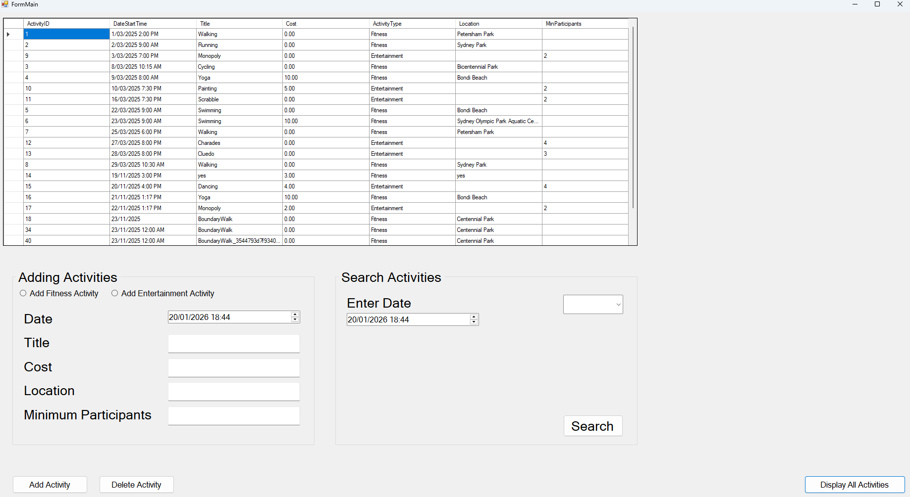

# CSV Activity Dashboard

A C# Windows Forms desktop application that reads activity data from CSV files,
stores it in a SQL Server database, and allows users to view, add, and search
entertainment and fitness activities.

## Screenshots

### Dashboard

### Adding Activities

## Technologies Used
- C#
- .NET Windows Forms
- SQL Server (LocalDB)
- CSV Parsing

## Skills Demonstrated
- Object-Oriented Programming in C#
- Reading and parsing CSV data
- SQL Server database integration
- Desktop UI development with Windows Forms
- CRUD operations
